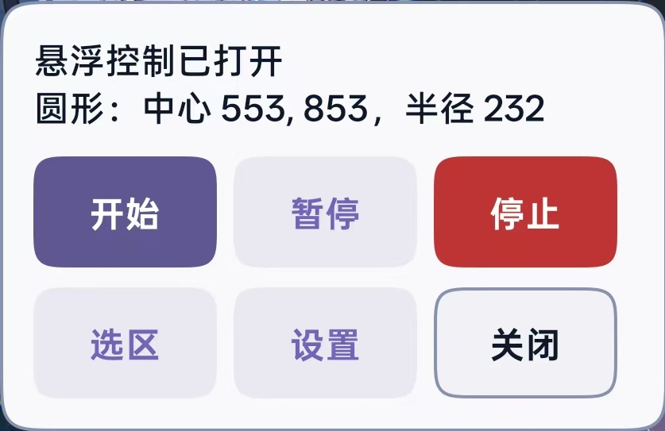
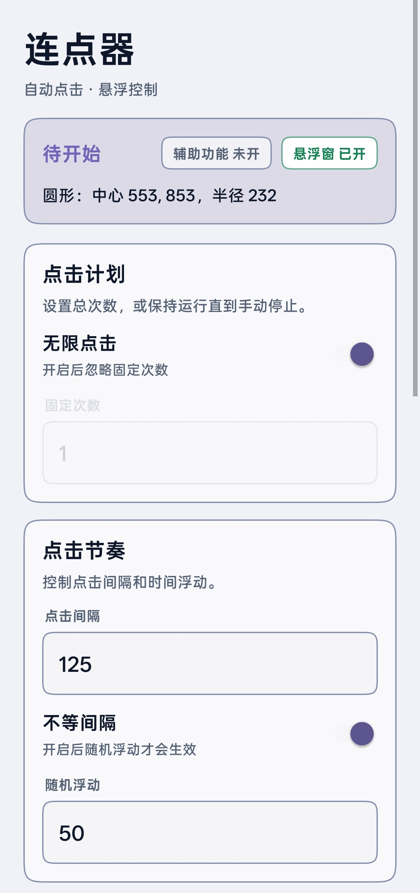
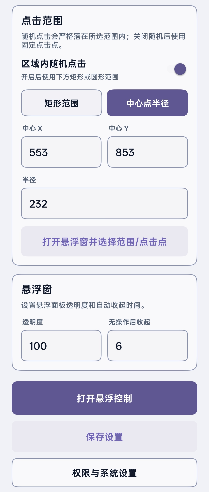
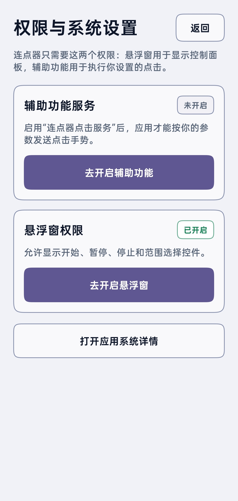

# 连点器 / Android Auto Clicker

[中文](README.md) | [English](README.en.md)


一个轻量、直观、偏 Material You 风格的安卓连点器。它通过 Android 辅助功能服务执行你主动配置的点击任务，并用悬浮窗提供开始、暂停、停止、选区和悬浮球控制。

它适合需要重复点击、固定点点击、区域内随机点击，或需要轻微随机间隔的场景。应用不需要 root，不读取目标应用内容，也不会上传数据。

[下载最新 APK](https://github.com/F111111shhh/android-auto-clicker/releases/latest)

## 界面预览

<table>
  <tr>
    <td align="center"><br>悬浮控制面板</td>
    <td align="center"><br>主设置界面</td>
  </tr>
  <tr>
    <td align="center"><br>点击范围设置</td>
    <td align="center"><br>权限与系统设置</td>
  </tr>
</table>

## 主要功能

- **点击次数**：支持固定次数，也支持无限点击并手动停止。
- **点击频率**：支持按点击间隔毫秒设置点击速度。
- **点击范围**：支持拖拽矩形区域，也支持中心点加半径的圆形范围。
- **随机点击**：开启后会在指定矩形或圆形范围内随机取点，避免超出已选区域。
- **固定点击点**：关闭区域随机后，可单独选择一个固定点击点。
- **不等间隔**：可开启随机时间浮动，让每次点击不完全按相同间隔触发。
- **悬浮控制**：支持开始、暂停/继续、停止、选择区域和回到设置。
- **悬浮球模式**：悬浮窗一段时间无操作后自动收起，点击悬浮球可再次展开。
- **透明度调节**：可调节悬浮窗透明度，减少常驻遮挡。
- **参数保存**：自动记住上次设置，下次打开继续使用。

## 界面设计

- 采用类似 Material You 的动态主题色，尽量贴近系统/壁纸色彩。
- 使用 superellipse/squircle 平滑圆角，让卡片、按钮和输入区域更接近 iOS/Figma 的连续曲线观感。
- 将权限入口放入独立页面，主界面更专注于点击参数。
- 开关关闭时，相关设置会自动置灰并禁止输入，避免无效配置。
- 主界面、权限页和悬浮窗都为状态栏与实际使用场景做了间距处理。

## 使用方法

1. 在 Release 页面下载并安装 APK。
2. 打开应用，进入权限页面开启悬浮窗权限。
3. 按提示进入系统辅助功能设置，启用“连点器点击服务”。
4. 回到应用设置点击次数、点击间隔、点击范围和随机选项。
5. 打开悬浮控制，在目标界面选择点击点或区域。
6. 点击悬浮窗上的开始，任务会按你的设置执行。

## 权限与隐私

- **悬浮窗权限**：用于显示控制面板、悬浮球和选区层。
- **辅助功能权限**：用于调用系统点击手势接口，执行你设置的屏幕点击。

应用不会请求 root 权限，不会读取目标应用中的文字、图片或账号信息，不会上传点击配置或设备数据。

## 注意事项

请只在你有权操作的应用和场景中使用本工具。部分游戏、平台或应用可能禁止自动点击行为，使用前请自行确认相关规则。

## 本地构建

项目使用原生 Android Views 和 Java。构建 release APK：

```powershell
$env:JAVA_HOME='C:\Program Files\Android\Android Studio\jbr'
$env:ANDROID_HOME='C:\Users\FISH\AppData\Local\Android\Sdk'
.\gradlew.bat :app:assembleRelease
```

本地签名文件位于 `keystore/`，已被 `.gitignore` 排除，不会上传到 GitHub。
